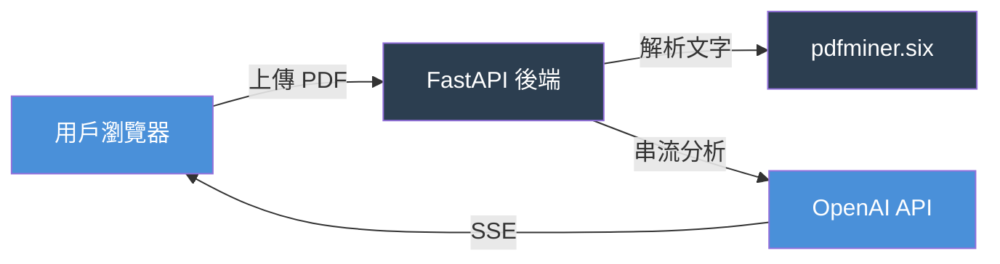

# Product Pitch 生成器

將此 prompt 完整複製，貼到 Claude Code 對話框後送出。

---

請依照以下 4 個步驟，幫我生成一份 Product Pitch 簡報（Markdown 格式）。

## Step 1：讀取文件，輸出資訊清單

讀取以下兩份文件：
- `docs/superpowers/specs/` 目錄下最新的 design doc（檔名含 `design.md`）
- `docs/superpowers/plans/` 目錄下最新的 plan doc

讀取後，輸出一張清單，標示每個簡報章節的資訊狀態：

| 簡報章節 | 狀態 | 來源 |
|---------|------|------|
| 問題背景 | ✅ 已有 / ❌ 缺少 | ... |
| 目標用戶 / Persona | ✅ 已有 / ❌ 缺少 | ... |
| 解決方案 | ✅ 已有 / ❌ 缺少 | ... |
| 核心功能 | ✅ 已有 / ❌ 缺少 | ... |
| 北極星指標 | ✅ 已有 / ❌ 缺少 | ... |
| 子指標表格 | ✅ 已有 / ❌ 缺少 | ... |
| 技術架構 | ✅ 已有 / ❌ 缺少 | ... |
| Demo 截圖 | ⚠️ 需學員提供 | — |
| Roadmap | ✅ 已有 / ❌ 缺少 | ... |

## Step 2：逐一補問缺少的欄位（嚴格順序）

**規則（必須遵守）：**
1. 對每個 ❌ 欄位，**只提一個問題**
2. **必須等到學員回答後**，才提下一個欄位的問題
3. 不允許一次提多個問題、不允許跳過欄位
4. 如果學員回答不夠具體，追問一次後才繼續下一欄位

對當前欄位提問格式：
> 請填寫：**[欄位名稱]**
> [1-2 句說明這個欄位的重要性]
> 我在等你的回答...

## Step 3：確認閘（重要）

所有欄位補齊後，輸出完整摘要，等我輸入「確認」才繼續：

---
**請確認以下資訊後輸入「確認」：**

- 產品名稱：[從 spec 提取]
- 問題背景：[2-3 句]
- 目標用戶：[角色 + 痛點]
- 北極星指標：[名稱 + 定義]
- 子指標：[條列]
- Roadmap：[3 個 next steps]
---

## Step 4：生成 `docs/product-pitch.md`

確認後，生成以下格式並儲存：

```markdown
# [產品名稱] Product Pitch

## 問題背景
[2-3 句]

## 目標用戶
**Persona：** [角色名稱]
- 身份：[描述]
- 痛點：[描述]
- 使用情境：[描述]

## 解決方案
[1-2 句]

## 核心功能
- [功能 1-5]

## 產品指標

### 北極星指標
> **[指標名稱]**：[定義]

### 子指標
| 指標 | 類型 | 衡量什麼 |
|------|------|---------|

## 技術架構



## Demo 截圖


## 下一步 Roadmap
1. [Next step 1]
2. [Next step 2]
3. [Next step 3]
```
